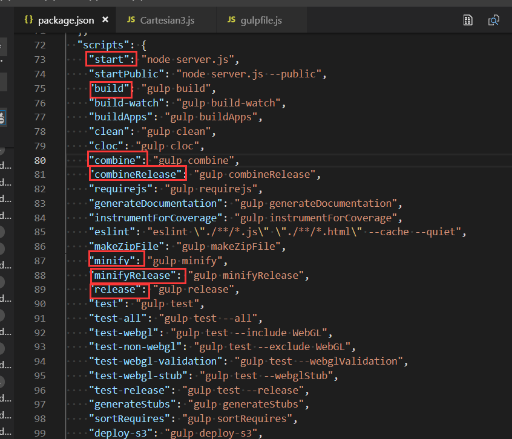
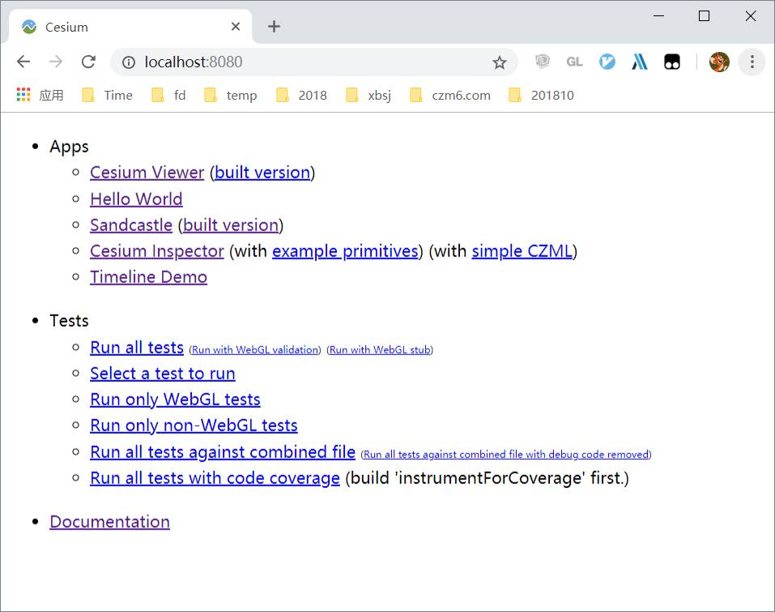

# 📚cesium命令总结

## 📖 常用命令



### npm run start

这个命令是启动Cesium自己写的一个http服务，虽然不是打包命令，但是比较典型，这里简单介绍一下。  执行这个命令以后，就可以启动服务了，端口号强制为8080。这个时候可以在浏览器中输入localhost:8080，效果如下：



**注意点1：** 如果这个端口号被占用，那么对不起，服务起不来。没有webpack那么机智，不会自动替换一个端口号。

所以有时候，如果真的不想停止现有的8080端口服务。可以手动换个端口号运行，执行下面的命令：

```
node server.js --port 8081
```

**注意点2：** 另外还有一个值得注意的问题，Cesium的npm start命令启动的服务， **只能在本机查看** ，如果想在局域网内其他机器上观看，是不行的。如何解决这个问题呢？可以运行以下命令来搞定：

```
npm run startPublic
```

注意，必须要加上 **run** ，否则还是跑不起来的。

### npm run build

Cesium的npm run build命令，和其他一些开源库，真的是有点儿差别。大部分项目执行这个命令的意思，一般都是打包生成一个dist文件夹，并且把编译压缩优化（生产环境下）的js放进去。但是Cesium却是在Source目录下生成了一个Cesium.js文件，注意您没看错，是 **Source** 文件夹下。当然也偷偷做了点别的事情，暂且不表。

> build命令执行的操作：
> 1、在Source目录下生成了一个Cesium.js文件
>
> 2、将Source/Shader下的glsl文件转为js文件（如果不build 则start中的示例无法运行）
>
> 3、在APP/Sandcastle下扫描gallery内的示例文件，并生成示例索引gallery-index.js,用于在start命令页的Sandcastle，组织沙盒示例，在控制台中调试。


输入图片说明

重要的事情再说一遍：Source文件夹下的这个Cesium.js文件，默认情况下是没有的，并不是源码文件，是运行`npm run build`命令构建出来的js文件。

奇怪了，Cesium打包的结果，为什么要放在Source文件夹下？

其实这里的Cesium.js文件并不是真正意义上对外输出（生产环境下）的js文件，仅仅是把Cesium源码中一千两百多个js文件做了一下引用。。所以这个Cesium.js也就相当于一个索引。这样外界使用时，只要引用这么一个Cesium.js文件，就会通过AMD模式自动引入其他Cesium的源码js文件来使用。

这是Cesium打包时的一个比较特殊的地方，Cesium通过这种方式，就可以在网页中直接调试源码了。很遗憾，Cesium并没有使用目前比较流行的SourceMap的方式。

那么既然`npm run build`命令并不会进行打包，那么真正的打包命令是什么呢？这里就要说到`npm run minifyRelease`命令了。

### npm run minifyRelease

这个命令会把Source目录下所有的js文件打包放到Build/Cesium/目录下，并且生成一个真正的供生产环境下来使用的Cesium.js文件。因为执行了各种编译压缩打包等操作，所以编译速度比较慢，在我的机器上，大概需要2分钟才能编译完。。


输入图片说明

我们再来分析一下这个命令的操作，如下图所示：


输入图片说明

`outputDirectory`选项中可以看到，Cesium把压缩优化后的Cesium.js文件放在了Build/Cesium/目录下。

`optimizer`选项则表示js代码如何压缩优化，Cesium使用的是uglify2。

`removePragmas`选项是用来删除源码中的调试信息的。我们查看Cesium源码时，有时会发现源码中有大量的`includeStart`开头的注释，如下图所示。这里面大多是调试信息，removePragmas设置为true，相当于来删除`includeStart`和`includeEnd`之间的js语句。


输入图片说明

### npm run minify

`npm run minify`命令的配置如下图所示，可以看到他会压缩优化js代码，但是不会去掉调试信息。


输入图片说明

### npm run combine

`npm run combine`命令则是既不压缩优化，也不去掉调试信息。相当于生成具备调试信息的js文件。

> 注释：当前1.78版本，支持sourcemap


输入图片说明

### npm run combineRelease

`npm run combineRelease`命令相当于不进行压缩优化，但是去掉了调试信息。


输入图片说明

### npm run release

`npm run release`命令则相当于combine、minifyRelease、generateDocumentation三个命令的集合。他会同时做了三件事：

1. 在Build/CesiumUnminified目录下生成调试版的Cesium.js文件；
2. 在Build/Cesium目录下生成压缩优化好的(生产环境下）的Cesium.js文件；
3. 并且还生成了Cesium的api文档，文档放在Build/Documentation目录下。


输入图片说明

### npm run buildApps

`npm run buildApps`做了2件事：

* 在Build/Apps目录下生成构建版的CesiumViewer（start界面中的built version)；
* 在Build/Apps目录下生成构建版的Sandcastle（start界面中的built version)；

`npm run buildApps`运行成功的前提是提前在Build目录下放置构建好的Cesium文件夹，即先执行`npm run minifyRelease`或者`npm run minify`命令，否则会报错。因为Build/Apps调试台引用的Build/Ceiusm下的Cesium.js，而原来/Apps下的调试台引用的Source/下的Cesium.js。如果没有自定义构建的Cesium文件夹，可将`npm run combineRelease`或者`npm run combine`的内容全部拷贝至Build/Ceiusm下。


### 打包遗留问题

#### 看不到Development分组

很多同学会反馈Cesium的示例代码中有的时候看不到Development分组。


输入图片说明

这主要是因为`npm run build`和`npm run release`命令都会生成Apps/Sandcastle/gallery/gallery-index.js文件，这个文件是用来管理Cesium的示例目录的。然而后者生成的gallery-index.js文件会去掉develop分组。所以实际情况是，执行了`npm run release`命令以后，Development分组就会消失。如果希望再次看到，方法也很简单，就是再次执行一下`npm run build`命令即可。

#### 编译包和源码包的区别

Cesium官方在github中会同时提供两个版本的zip包，头一个是Cesium事先打包编译好的，这个zip包里面会有Build目录。在自己的项目中直接拿来引用Build/Cesium/Cesium.js就好。但是您在这个zip包里面是看不到Cesium示例中的development分组的，而且也不能执行`npm run build`进行编译（部分编译文件被移除）。

如果希望看到development分组示例，或者修改Cesium源码的话，就只能用第二个zip包了。这个zip包里面只有源码，需要自行打包。


输入图片说明

### 总结

1. npm run build 只是生成了一个Source目录的Cesium.js文件，相当于一个索引；
2. npm run minifyRelease 才是真正用来输出生产环境下的Cesium.js文件，输出目录在Build/Cesium/下；
3. npm run release 同时输出调试版的Cesium.js、生产环境下的Cesium.js和api文档。
