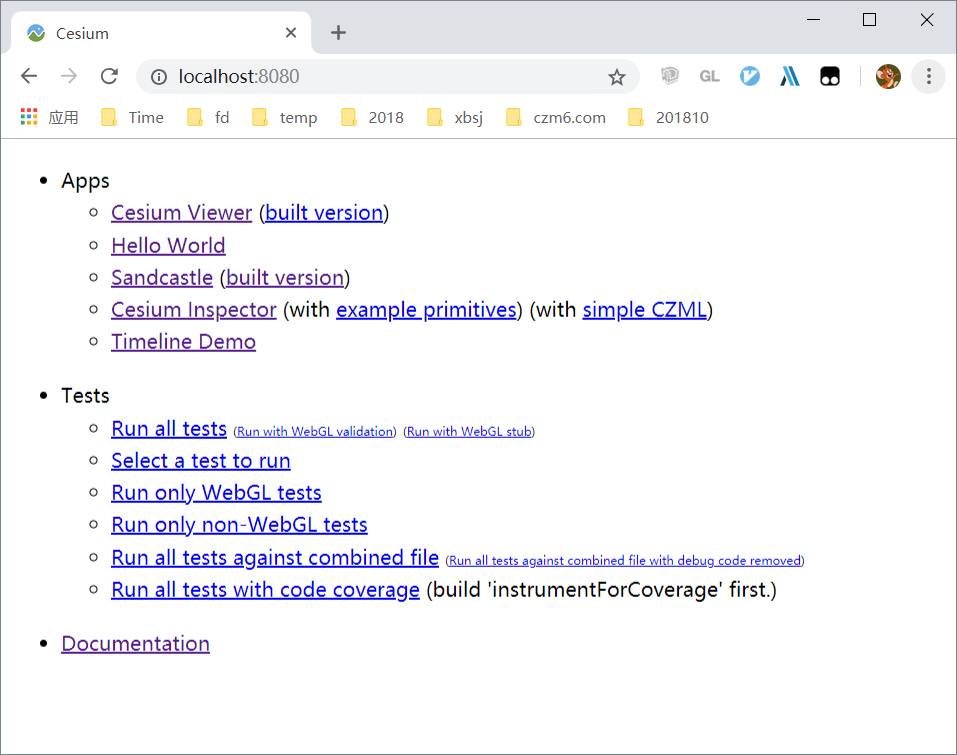

## 🚀️ npm run start

这个命令是启动Cesium自己写的一个http服务，虽然不是打包命令，但是比较典型，这里简单介绍一下。  执行这个命令以后，就可以启动服务了，端口号强制为8080。这个时候可以在浏览器中输入localhost:8080，效果如下：



**注意点1：** 如果这个端口号被占用，那么对不起，服务起不来。没有webpack那么机智，不会自动替换一个端口号。

所以有时候，如果真的不想停止现有的8080端口服务。可以手动换个端口号运行，执行下面的命令：

```
node server.js --port 8081
```

**注意点2：** 另外还有一个值得注意的问题，Cesium的npm start命令启动的服务， **只能在本机查看** ，如果想在局域网内其他机器上观看，是不行的。如何解决这个问题呢？可以运行以下命令来搞定：

```
npm run startPublic
```

注意，必须要加上 **run** ，否则还是跑不起来的。

## 📖 Cesium Viewer

🔖 用于查看图形数据的app，

## 📖 Cesium Viewer(built version)
